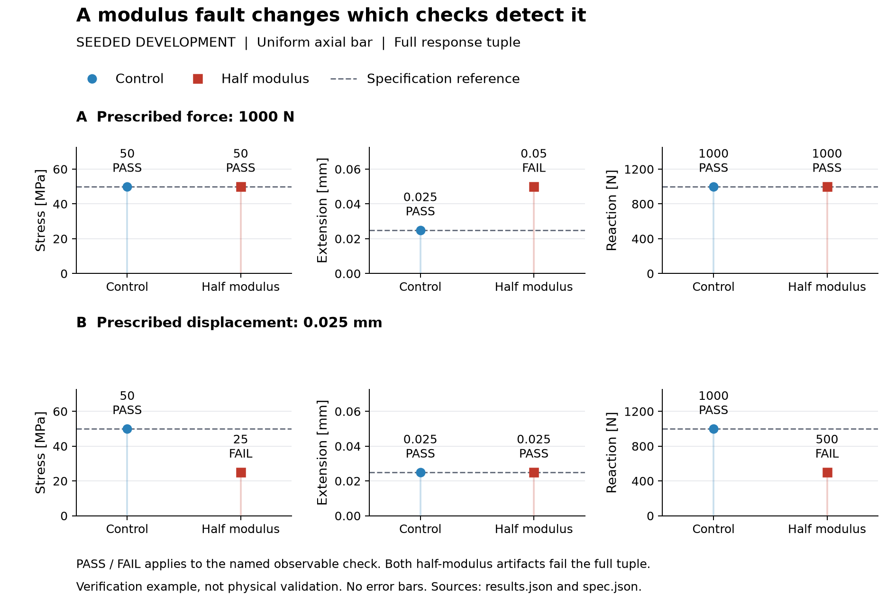

# Evidence-sufficiency development results

**Seeded development. Verification example, not physical validation.**

One axial-bar family, two loading conventions. Correctness means the full
stress, extension and reaction tuple agrees with the original specification.
A PASS in one check does not certify that tuple. Completion checks finite outputs only.

Source: [results.json](results.json). Configuration: [spec.json](../../studies/evidence_sufficiency/spec.json).
Downloads: [outcomes.csv](outcomes.csv), [policies.csv](policies.csv).
Values below are rounded for display; downloads retain stored precision.

[Vector figure](boundary-condition.svg). Both half-modulus artifacts fail the full tuple,
but different observable checks detect the fault under each loading convention.

## Prescribed force

Original reference: stress **50.0 MPa**, extension **0.0250 mm**, reaction **1000.0 N**.
Reaction is the positive tensile force magnitude.

### Artifact outputs

| Artifact | Stress [MPa] | Extension [mm] | Reaction [N] | Full tuple |
| :--- | ---: | ---: | ---: | :--- |
| Correct control | 50.0 | 0.0250 | 1000.0 | Correct |
| Benign partition | 50.0 | 0.0250 | 1000.0 | Correct |
| Nuisance density | 50.0 | 0.0250 | 1000.0 | Correct |
| Modulus fault | 50.0 | 0.0500 | 1000.0 | Incorrect |
| Area fault | 100.0 | 0.0500 | 1000.0 | Incorrect |
| Load fault | 25.0 | 0.0125 | 500.0 | Incorrect |

### Executed checks

| Artifact | Completion | Stress | Extension | Reaction |
| :--- | :---: | :---: | :---: | :---: |
| Correct control | PASS | PASS | PASS | PASS |
| Benign partition | PASS | PASS | PASS | PASS |
| Nuisance density | PASS | PASS | PASS | PASS |
| Modulus fault | PASS | PASS | **FAIL** | PASS |
| Area fault | PASS | **FAIL** | **FAIL** | PASS |
| Load fault | PASS | **FAIL** | **FAIL** | **FAIL** |

## Prescribed displacement

Original reference: stress **50.0 MPa**, extension **0.0250 mm**, reaction **1000.0 N**.
Reaction is the positive tensile force magnitude.

### Artifact outputs

| Artifact | Stress [MPa] | Extension [mm] | Reaction [N] | Full tuple |
| :--- | ---: | ---: | ---: | :--- |
| Correct control | 50.0 | 0.0250 | 1000.0 | Correct |
| Benign partition | 50.0 | 0.0250 | 1000.0 | Correct |
| Nuisance density | 50.0 | 0.0250 | 1000.0 | Correct |
| Modulus fault | 25.0 | 0.0250 | 500.0 | Incorrect |
| Area fault | 50.0 | 0.0250 | 500.0 | Incorrect |
| Load fault | 25.0 | 0.0125 | 500.0 | Incorrect |

### Executed checks

| Artifact | Completion | Stress | Extension | Reaction |
| :--- | :---: | :---: | :---: | :---: |
| Correct control | PASS | PASS | PASS | PASS |
| Benign partition | PASS | PASS | PASS | PASS |
| Nuisance density | PASS | PASS | PASS | PASS |
| Modulus fault | PASS | **FAIL** | PASS | **FAIL** |
| Area fault | PASS | PASS | PASS | **FAIL** |
| Load fault | PASS | **FAIL** | **FAIL** | **FAIL** |

## Comparator smoke test

Each comparator is scored on the same **12 development artifacts**.
Random counts are exact expectations over equal-cost choices, not sampled trials.
No LLM reviewers were run. These selected seeded faults establish no general policy ranking.

### Decision counts

| Policy | Wrong accepts [count] | Wrong rejects [count] | Abstentions [count] |
| :--- | ---: | ---: | ---: |
| Fixed stress | 2 | 0 | 0 |
| Random (exact) | 3 | 0 | 0 |
| Modulus sensitivity | 1 | 0 | 0 |
| All checks | 0 | 0 | 0 |
| Cautious stress | 0 | 0 | 8 |
| Always abstain | 0 | 0 | 12 |

### Coverage and cost

Coverage is the fraction accepted or rejected. Error is wrong decisions / all decisions.
Costs are abstract acquisition tokens; setup and runtime are not measured.

| Policy | Coverage [%] | Mean cost [tokens/artifact] | Decision error [%] |
| :--- | ---: | ---: | ---: |
| Fixed stress | 100.0 | 1 | 16.7 |
| Random (exact) | 100.0 | 1 | 25.0 |
| Modulus sensitivity | 100.0 | 1 | 8.3 |
| All checks | 100.0 | 4 | 0.0 |
| Cautious stress | 33.3 | 1 | 0.0 |
| Always abstain | 0.0 | 0 | N/A (no decisions) |

**Matched coverage and cost:**

Fixed stress, Random (exact), Modulus sensitivity (`coverage=1,mean_cost=1`).

The other policies use different coverage or cost and are separate controls.
Always abstaining has undefined decision error and cannot win on accuracy.

Generated by `python -m studies.evidence_sufficiency.run`.
[Derivation and limits](../../studies/evidence_sufficiency/README.md).
